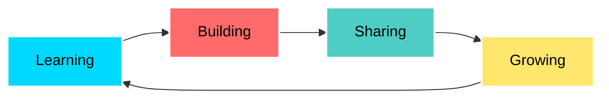

<div align="center">

<!-- Header Banner -->


<!-- Animated Typing Text -->


<br>

<!-- Social Badges -->
[](https://github.com/Steirner)
[](https://github.com/Steirner)
[](https://github.com/Steirner)

</div>

---

## 🌟 About Me

```typescript
const steirner = {
    location: "Limay Bataan, Philippines 🇵🇭",
    role: "Full Stack Developer",
    education: "Associated of computer technology",
    passion: ["Coding", "Design", "Innovation", "Music"],
    currentFocus: "Building scalable web applications",
    funFact: "I code better with good music 🎵",
    lifePhilosophy: "Champagne Face ✨ - Living life with style and code",
    
    workingOn: {
        learning: ["Advanced Rust", "Cloud Architecture", "Web3 Development"],
        building: ["Open Source Projects", "Creative Web Experiences"],
        improving: ["System Design", "Algorithm Optimization"]
    }
};
```

<div align="center">

## 🛠️ Technology Stack

</div>

### 💻 Programming Languages

<div align="center">


</div>

### 🎨 Frontend Development

<div align="center">


</div>

### ⚙️ Backend & Frameworks

<div align="center">


</div>

### 🗄️ Databases & Cloud

<div align="center">


</div>

### 🔧 DevOps & Tools

<div align="center">


</div>

### 🎨 Design & Creative Suite

<div align="center">


</div>

### 🌐 Blockchain & Web3

<div align="center">


</div>

---

<div align="center">

## 📊 GitHub Analytics & Activity


</div>

---

<div align="center">

## 🏆 GitHub Trophies

[](https://github.com/ryo-ma/github-profile-trophy)

</div>

---

<div align="center">

## 💭 Developer Wisdom


</div>

---

<div align="center">

## 🎯 Current Focus & Goals

</div>



<div align="left">

🎯 **2026 Goals:**
- 🚀 Contribute to major open-source projects
- 📚 Master cloud architecture and microservices
- 🎨 Build 5+ production-ready web applications
- 🤝 Collaborate with developers worldwide
- 📝 Write technical articles and tutorials

</div>

---

<div align="center">

## 💰 Support My Journey

*If you find my work valuable, consider buying me a coffee! ☕*

### 🇵🇭 GCash Donation


<br><br>

📱 **Mobile Number:** `+63 930 359 ••••`

<br>


---

### 💝 Your Support Helps Me:

<table>
<tr>
<td align="center" width="25%">
<br>
<b>Build More</b><br>
<sub>Open-source projects</sub>
</td>
<td align="center" width="25%">
<br>
<b>Learn More</b><br>
<sub>New technologies</sub>
</td>
<td align="center" width="25%">
<br>
<b>Code More</b><br>
<sub>Fueled by caffeine</sub>
</td>
<td align="center" width="25%">
<br>
<b>Improve More</b><br>
<sub>Better tools & resources</sub>
</td>
</tr>
</table>

<sub>Every contribution, no matter how small, makes a huge difference! 🙏</sub>

</div>

---

<div align="center">

## 🤝 Let's Connect!

[](https://github.com/Steirner)
[](mailto:kunphisher@gmail.com)

</div>

---

<div align="center">

## 📈 Contribution Activity

<!--START_SECTION:activity-->
<!--END_SECTION:activity-->


</div>


<div align="center">


</div>

---

<div align="center">

## ⚡ Fun Facts

- 🎮 Gaming enthusiast when not coding
- 🎵 Music is my coding fuel
- 🌙 Night owl developer
- 📚 Constantly learning and experimenting
- ✨ Believer in clean code and good design
- 🚀 Dream: Build products that impact millions

</div>

---

<div align="center">

### 📊 Profile Insights


<br>

**"Code is like humor. When you have to explain it, it's bad." - Cory House**

<br>

### ⭐ If you like my work, consider giving my repos a star!

<sub>Made with ❤️ by Steirner | Last Updated: January 2026</sub>

</div>

---

<!-- Footer Wave -->


</div>
